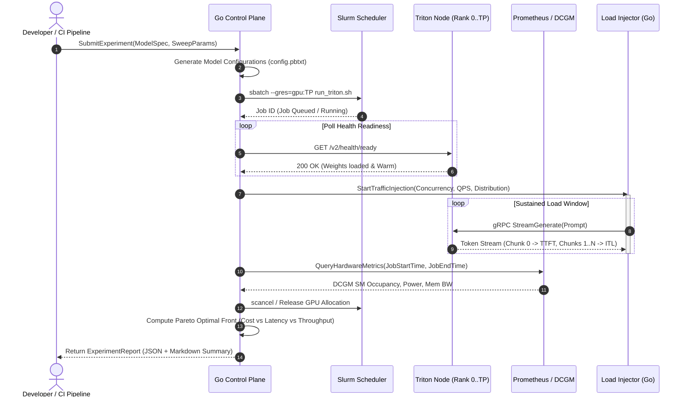

# High-Level Design (HLD): Distributed LLM Inference Profiler & Orchestrator

## 1. Executive Summary & Objective

Modern LLM deployment at hyperscale requires navigating a multi-dimensional optimization space:
- **Serving Backends**: Triton with TensorRT-LLM (`tensorrt_llm_backend`) vs. Triton with vLLM engine.
- **Parallelism Strategies**: Tensor Parallelism ($TP \in [1, 2, 4, 8]$) across intra-node NVLink vs. Pipeline Parallelism ($PP$) across InfiniBand/RoCE fabrics.
- **Serving Dynamics**: In-Flight Batching (continuous batching), PagedAttention KV-cache allocation, chunked prefill, and quantization formats (FP16, BF16, FP8 E4M3/E5M2, INT4 AWQ).
- **Service Level Objectives (SLOs)**: Strict trade-offs between Time-To-First-Token (TTFT / prefill latency), Inter-Token Latency (ITL / decode latency), and Aggregate Throughput (tokens/sec/GPU).

This project implements a cloud-native and HPC-aware **Distributed LLM Profiling & Orchestration Control Plane** written in **Go (Golang)**. The system accepts declarative model benchmarking specs, dynamically provisions isolated multi-GPU environments via **Slurm** (or Kubernetes), launches containerized **Triton Inference Server** clusters with orchestrated TensorRT-LLM/vLLM backends, injects realistic synthetic traffic distributions, collects granular GPU hardware and serving telemetry via **Prometheus** and **NVIDIA DCGM**, and automates regression gating in **CI/CD**.

---

## 2. End-to-End System Architecture

```
+---------------------------------------------------------------------------------------------------+
|                                       CI/CD & Developer Client                                    |
|   (GitHub Actions Workflow / CLI Client / Automated Regression Gating Budget Check)               |
+-------------------------------------------------+-------------------------------------------------+
                                                  |
                                                  | gRPC (RunExperiment / StreamTelemetry)
                                                  v
+---------------------------------------------------------------------------------------------------+
|                        Go Control Plane Orchestrator (Daemon / Core Service)                      |
|                                                                                                   |
|  +---------------------+   +---------------------+   +---------------------+   +---------------+  |
|  | Experiment Engine   |   | Matrix Sweep Engine |   | Traffic Generator   |   | Telemetry &   |  |
|  | & Job State Machine |-->| (TP, Batch, Quant)  |-->| (Poisson / Pareto)  |-->| Regression    |  |
|  +----------+----------+   +----------+----------+   +----------+----------+   | Evaluator     |  |
|             |                         |                         |              +-------+-------+  |
+-------------|-------------------------|-------------------------|----------------------|----------+
              | Cluster Allocation      | Model Config Generation | Streaming Inference  | Telemetry Query
              v                         v                         v                      v
+-----------------------------+ +-------------------------------+ +-------------------+ +--------------+
| HPC / Cluster Scheduler API | | Model Store & Config Engine   | | Triton Inference  | | Observability|
| - Slurm REST API / CLI      | | - Dynamic config.pbtxt        | | Server Clusters   | | - Prometheus |
| - sbatch / srun / scancel   | | - Engine build artifacts      | | (v2 gRPC / HTTP)  | | - NVIDIA DCGM|
| - Pyxis / Enroot Containers | | - S3 / Shared NFS / Lustre    | | - K-Cache Paging  | | - Node Exp.  |
+--------------+--------------+ +---------------+---------------+ +---------+---------+ +------+-------+
               |                                |                           |                  |
               +--------------------------------+---------------------------+------------------+
                                                |
                                                v
               +----------------------------------------------------------------+
               |                    Physical / Virtual GPU Nodes                |
               |                                                                |
               |   [Node 1: Master Worker]             [Node N: Worker]         |
               |   +--------------------------+        +---------------------+  |
               |   | Triton Server Instance   |        | Triton TRT-LLM /    |  |
               |   | - TRT-LLM Backend        |<======>| MPI Worker          |  |
               |   | - Leader / Rank 0        | NVLink | - Rank 1..TP-1      |  |
               |   | - In-Flight Batcher      | IB/RoCE|                     |  |
               |   +------------+-------------+        +----------+----------+  |
               |                |                                 |             |
               |   +------------v-------------+        +----------v----------+  |
               |   | GPU 0 (DCGM Exporter)    |        | GPU N (DCGM Exporter|  |
               |   +--------------------------+        +---------------------+  |
               +----------------------------------------------------------------+
```

---

## 3. Core Subsystems & Components

### 3.1. Go Control Plane (Orchestrator)
The brain of the system, built for high concurrency and deterministic execution.
- **gRPC API Layer**:
  - `SubmitExperiment(ExperimentSpec) returns (ExperimentHandle)`
  - `StreamMetrics(ExperimentHandle) returns (stream MetricSample)`
  - `EvaluateRegression(RegressionPolicy) returns (RegressionReport)`
- **Experiment State Machine**:
  - `PENDING` $\to$ `PROVISIONING` $\to$ `WARMING_UP` $\to$ `BENCHMARKING` $\to$ `COLLECTING` $\to$ `TEARDOWN` $\to$ `COMPLETED` / `FAILED`.
- **Matrix Sweep Generator**:
  - Computes orthogonal or grid permutations across:
    - Tensor Parallelism: $TP \in [1, 2, 4, 8]$
    - Max Batch Size: $[1, 2, 4, 8, 16, 32, 64, 128]$
    - KV Cache Quantization: `FP16` vs. `FP8` vs. `INT4`
    - In-Flight Batching Schedulers: Max Requests, Chunked Prefill Token Limits.
- **Traffic Injection Engine**:
  - High-throughput asynchronous Go worker pool emitting concurrent Triton v2 gRPC requests.
  - Configurable arrival distributions: Uniform, Poisson Process (exponential inter-arrival), Burst/Pareto.
  - Streaming token recorder: records exact timestamp for prompt response packet 0 (TTFT) and delta between successive stream chunks (ITL).

### 3.2. Cluster Scheduler Adapter (Slurm & Container Runtime)
Enables transparent scheduling across high-performance supercomputing environments:
- **Slurm Driver**:
  - Generates parameterized `#SBATCH` scripts with strict GRES bindings (`--gres=gpu:8`, `--ntasks-per-node=8`, `--cpus-per-task=12`).
  - Utilizes **Pyxis / Enroot** for unprivileged, low-overhead container execution on shared clusters with NVLink passthrough.
  - Polls job states via Slurm REST API (or CLI fallback: `squeue`, `sacct`) with exponential backoff.
- **Local / Docker Mock Driver**:
  - Spin up local Docker-compose or container stacks with CPU or single-GPU mock Triton servers for development, unit testing, and CI environments lacking multi-node H100 hardware.

### 3.3. Triton Inference Server & LLM Backends
Hosts the target models with production-grade serving configurations:
- **Triton C++ Architecture**:
  - Custom `config.pbtxt` generation based on sweep dimensions.
  - Dynamic sequence batching configuration (`decoupled: true` for streaming output).
  - Health & Readiness endpoints (`/v2/health/ready`, `/v2/health/live`).
- **TensorRT-LLM Backend**:
  - Multi-process MPI orchestrator (`mpirun -n $TP trtllmExecutorWorker`).
  - Paged KV-Cache memory pool allocation (allocating ~85-90% free VRAM).
  - Custom CUDA kernels for FP8 GEMM and FlashAttention-2/3.
- **vLLM Backend (Alternative Comparator)**:
  - Triton vLLM backend container comparison to benchmark TRT-LLM against vLLM under identical memory footprint and prompt length.

### 3.4. Telemetry, Profiling & Metrics Aggregator
Collects synchronous serving metrics and asynchronous hardware metrics:
- **Triton Native Metrics (`:8002/metrics`)**:
  - `nv_inference_request_duration_us`, `nv_inference_queue_duration_us`, `nv_inference_compute_infer_duration_us`.
- **NVIDIA DCGM (Data Center GPU Manager)**:
  - GPU engine utilization (`dcgm_gpu_utilization`).
  - VRAM allocation and framebuffer usage (`dcgm_fb_used_percent`).
  - SM Active / SM Occupancy and Tensor Core pipeline activity.
  - Power draw & thermal throttling metrics (`dcgm_power_usage`, `dcgm_clock_throttle_reasons`).
- **Control Plane Client-Side Telemetry**:
  - Nanosecond-precision TTFT histogram ($p50, p90, p95, p99$).
  - Inter-Token Latency (ITL) jitter and tail latency.
  - Token throughput ($Tokens_{out} / sec$ and $TotalTokens / sec / GPU$).

### 3.5. CI/CD Contract & Regression Testing Gating
- Automated GitHub Actions runner integration.
- Configurable **Performance Budget Spec** (`budget.yaml`):
  ```yaml
  budgets:
    - model: "llama-3-8b-instruct"
      target_concurrency: 32
      sla:
        max_p99_ttft_ms: 120.0
        max_p95_itl_ms: 22.0
        min_output_tokens_per_sec: 1800.0
      regression_threshold_pct: 5.0 # Fails if >5% slower than base commit
  ```
- Generates markdown benchmark diffs, Pareto frontier curves, and posts PR status comments.

---

## 4. End-to-End Data & Execution Flow



---

## 5. Failure Modes, Edge Cases & Mitigation Strategies

| Failure Scenario | Root Cause | Architectural Mitigation |
| :--- | :--- | :--- |
| **CUDA OOM during Profiling** | Batch size or KV cache exceeded available VRAM for chosen $TP$. | Orchestrator catches Triton crash or HTTP 500 error, logs exact OOM parameters, marks matrix cell as `OOM_INVALID`, and continues sweep without terminating the entire experiment. |
| **Slurm Node Preemption / Hang** | Compute node hardware failure or higher-priority job preemption. | Heartbeat monitoring with configurable timeout ($T_{timeout} = 180s$). Automatic retry on alternative node allocation or clean job cancellation. |
| **In-Flight Batching Starvation** | Prefill phase for huge prompt lengths blocks decode phase for active queries. | Profiler tests chunked prefill (`kv_cache_free_gpu_mem_fraction` and `max_num_seqs`) to discover optimal chunk boundaries. |
| **Client Profiler Bottleneck** | Benchmark generator CPU saturation skewing measured TTFT. | Profiler written in zero-allocation Go routines with pre-allocated buffer pools and connection pooling across multiple worker threads. |
| **Network Fabric Contention** | Distributed TP across nodes without NVLink causing NCCL all-reduce bottlenecks. | Topology check in control plane: restricts TP to intra-node NVLink domains unless specifically benchmarking multi-node PP. |

---

## 6. Target Directory Layout

```
Distributed_LLM_ControlPlane/
├── cmd/
│   ├── controlplane/       # Main daemon entrypoint (gRPC server)
│   ├── profiler/           # CLI load generator & standalone benchmark tool
│   └── mock-cluster/       # Simulated Slurm & Triton environment for CI/dev
├── api/
│   └── proto/v1/           # Protobuf definitions for Experiment, Metrics, Scheduler
├── internal/
│   ├── orchestrator/       # State machine, experiment runner, sweep planner
│   ├── scheduler/          # Slurm client, Kubernetes client, Docker local runner
│   ├── triton/             # Triton config generator, health checker, client
│   ├── traffic/            # Synthetic load generators (Poisson, bursty, trace-replay)
│   ├── collector/          # Prometheus, DCGM, and client-side metrics aggregator
│   └── regression/         # Performance budget comparator and markdown reporter
├── configs/
│   ├── models/             # Sample model configurations (Llama-3-8B, etc.)
│   └── budgets/            # SLA and regression budget rules
├── deployments/
│   ├── slurm/              # sbatch templates and Pyxis container launch scripts
│   ├── docker/             # Docker Compose setups for local Triton + Prometheus
│   └── github-actions/     # Workflow definitions for automated PR gating
├── scripts/                # Helper tools, engine build scripts, benchmark visualizer
├── docs/                   # Documentation, architectural decisions, reports
├── go.mod
└── go.sum
```
